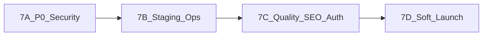

# TutorConnect India — Go-Live Implementation Plan (Phase 7)

**Version:** 1.0  
**Date:** 27 Aug 2026  
**Author:** Product & Engineering  
**Target:** Invite-only soft launch (~3–4 weeks)  
**Sources:** Go-live readiness audit · `IMPLEMENTATION_PLAN.md` v1.5 · `OWASP_CHECKLIST.md` · `RUNBOOK.md`  
**Tracker:** [`GO_LIVE_CHECKLIST.md`](./GO_LIVE_CHECKLIST.md)

---

## Start here

**Phase 7 code path complete** (7A–7D). Remaining: deferred VPS/Nginx/backup + live cohort soak (`docs/SOAK_CHECKLIST.md`).

Product Phases **0–6 are code-complete**. Phase 7 closes security remediations, staging ops, quality gates, and soft launch. Public open marketplace remains deferred until soak is clean.

---

## 1. Executive summary

| Item | Value |
|---|---|
| Goal | Safe invite-only soft launch on VPS + Nginx + TLS |
| In scope | 7A security → 7B staging → 7C quality/SEO/cookies → 7D soft launch |
| Out of scope | SMS/WhatsApp, native mobile, subscriptions, Elasticsearch, WAF/pen-test, video calls |
| Hosting | Single VPS + Docker Compose (Postgres/PostGIS + Redis) + Nginx + Let’s Encrypt |
| KYC media | Cloudinary **authenticated** resources + short-lived signed URLs |
| Sessions | Migrate to **httpOnly Secure cookies** in 7C (leave `localStorage` until then) |
| CI | Minimal GitHub Actions in 7C |
| Admin seed | Refuse default `Admin@123456` when `NODE_ENV=production` |

### Timeline overview

| Phase | Duration | Outcome |
|---|---|---|
| **7A — P0/P1 security** | ~1 week | Audit blockers fixed in code; unit tests green |
| **7B — Staging ops** | ~1 week | TLS staging, backups, Sentry, live SMTP/Razorpay smoke |
| **7C — Quality / SEO / auth** | ~1 week | CI, critical E2E, cookie sessions, SSR metadata |
| **7D — Soft launch** | ~1 week + soak | Invite cohort; close L1–L12; public open still deferred |

### Dependency order

---

## 2. Locked defaults

| Decision | Choice |
|---|---|
| Scope | Full path to invite-only soft launch (7A → 7D) |
| Hosting | VPS + Docker Compose + Nginx + Let’s Encrypt |
| KYC / agreement PDFs | Cloudinary authenticated + signed delivery |
| Web auth | httpOnly Secure cookies (Phase 7C) |
| CI | GitHub Actions: Jest + lint/build + `npm audit --omit=dev` |
| Payments in prod | `PAYMENTS_MOCK=false` required; mock-complete disabled |
| Document numbers | `DOCUMENT_ENCRYPTION_KEY` required in production |

---

## 3. Phase 7A — P0/P1 security code

**Goal:** Close critical/high findings from the go-live audit before any real money or KYC users on staging.

| # | Layer | Task | Audit ref | Primary files | Status |
|---|---|---|---|---|---|
| 7A.1 | BE | Refuse `SUSPENDED` on OTP verify, password login, refresh; never flip suspended → `ACTIVE` | P0 Auth | `api/src/auth/auth.service.ts` (~203–262), `jwt.strategy.ts` | [x] |
| 7A.2 | BE | Hard-fail `PAYMENTS_MOCK=true` when `NODE_ENV=production`; disable `POST /payments/mock-complete` in prod | P0 Payments | `api/src/main.ts`, `api/src/payments/payments.service.ts`, `payments.controller.ts` | [x] |
| 7A.3 | BE | Upload KYC / agreement PDFs as Cloudinary authenticated; serve via signed URL endpoints; stop returning permanent public URLs | P0 PII | `api/src/cloudinary/cloudinary.service.ts`, `verification.service.ts`, `agreements.service.ts` | [x] |
| 7A.4 | BE | Redact address / lat / lng for tutors on `getOne` (same rules as open list) | P1 Privacy | `api/src/requirements/requirements.service.ts` (~163+) | [x] |
| 7A.5 | BE | Bind student calendar `tutorId` to ACTIVE / PENDING_TUTOR_SIGN agreement ownership | P1 IDOR | `api/src/schedules/schedules.service.ts` (~238–239), `schedules.controller.ts` | [x] |
| 7A.6 | BE / INFRA | Hash OTPs at rest in Redis; document Redis `requirepass` + private bind (no public 6379 in staging) | P1 Secrets | `api/src/auth/auth.service.ts`, `docker-compose.yml`, `api/.env.example` | [x] |
| 7A.7 | BE | Require `DOCUMENT_ENCRYPTION_KEY` in production; block default admin password seed in prod | P1 Secrets | `api/src/common/pii-crypto.service.ts`, `api/src/main.ts`, `api/prisma/seed.ts` | [x] |
| 7A.8 | BE | Unit tests: suspended auth, mock-mode prod guard, schedule IDOR, address redaction | Quality | `api/src/**/*.spec.ts` | [x] |

### File touch list (7A)

- `api/src/auth/auth.service.ts`
- `api/src/auth/strategies/jwt.strategy.ts`
- `api/src/main.ts`
- `api/src/payments/payments.service.ts`
- `api/src/payments/payments.controller.ts`
- `api/src/cloudinary/cloudinary.service.ts`
- `api/src/verification/verification.service.ts`
- `api/src/agreements/agreements.service.ts`
- `api/src/requirements/requirements.service.ts`
- `api/src/schedules/schedules.service.ts`
- `api/src/common/pii-crypto.service.ts`
- `api/prisma/seed.ts`
- `docker-compose.yml`
- `api/.env.example`

### Phase 7A exit criteria

- [x] Suspended users cannot obtain tokens via OTP, password, or refresh
- [x] Production boot fails if `PAYMENTS_MOCK=true`; mock-complete returns 403/404 in prod
- [x] KYC and agreement PDFs are not permanently public; signed URLs expire
- [x] Tutor `GET /requirements/:id` does not leak full address/coords for open requirements
- [x] Student calendar cannot read arbitrary `tutorId` calendars
- [x] OTP stored hashed in Redis; staging Redis not exposed without AUTH
- [x] `DOCUMENT_ENCRYPTION_KEY` required in prod; seed refuses default admin password in prod
- [x] `cd api && npm test` green
- [x] `docs/OWASP_CHECKLIST.md` updated for closed rows

---

## 4. Phase 7B — Staging infra & money path

**Goal:** Reach a TLS staging environment with real SMTP and Razorpay smoke, backups, and monitoring.

| # | Layer | Task | Notes | Status |
|---|---|---|---|---|
| 7B.1 | INFRA | Provision VPS; harden SSH; Docker Compose for Postgres/PostGIS + Redis (**no public Redis port**) | Matches Appendix hosting decision | [~] deferred |
| 7B.2 | INFRA | Nginx reverse proxy + Let’s Encrypt for API + web | Separate server names or path routing | [~] deferred |
| 7B.3 | INFRA | Production-like env: JWT, SMTP, Cloudinary, Razorpay (test then live), `CORS_ORIGIN`, encryption key, `PAYMENTS_MOCK=false`, `NODE_ENV=production` | Never commit secrets | [~] deferred |
| 7B.4 | BE | Readiness endpoint: DB + Redis (+ optional BullMQ ping); keep shallow `/api/v1/health` as liveness | e.g. `/api/v1/health/ready` | [x] |
| 7B.5 | BE / FE | Sentry for API + web | Checklist item 0.1.11 | [x] |
| 7B.6 | INFRA | Nightly DB backup script + documented restore drill (run once successfully) | Script under `scripts/` preferred | [~] deferred |
| 7B.7 | OPS | Smoke: OTP email, search, registration payment, commission payment, webhook signature path | Record results in runbook | [~] deferred |

### Phase 7B exit criteria

- [~] Staging URLs serve over HTTPS — **deferred**
- [~] Redis not reachable from public internet; AUTH enabled — **deferred**
- [~] OTP email delivered via production SMTP — **deferred**
- [~] Razorpay test (then live) registration + commission + webhook verified — **deferred**
- [x] Readiness probe fails when DB or Redis down
- [x] Sentry SDK wired (set DSN to receive events)
- [~] Backup restored successfully once; steps in `RUNBOOK.md` — **deferred**
- [~] `PAYMENTS_MOCK=false` on staging — **deferred**

---

## 5. Phase 7C — Quality, SEO, session hardening

**Goal:** Automate quality gates, harden sessions, make public discovery crawlable, close payment/activation atomicity gaps.

| # | Layer | Task | Primary files | Status |
|---|---|---|---|---|
| 7C.1 | INFRA | GitHub Actions: `api` Jest + `web` lint/build + `npm audit --omit=dev` | `.github/workflows/ci.yml` | [ ] |
| 7C.2 | FE | Playwright critical path: register → requirement → apply → demo → agreement → pay (**mock on CI**) | `web/e2e/` | [ ] |
| 7C.3 | BE / FE | httpOnly Secure cookie sessions; CSRF strategy; remove tokens from `localStorage` | `web/lib/auth.ts`, `web/lib/api.ts`, `api/src/auth/*` | [ ] |
| 7C.4 | FE | SSR + `generateMetadata` for home, search, `/tutors/[id]`; add `sitemap.ts` + `robots.ts` | `web/app/[locale]/…` | [ ] |
| 7C.5 | BE | Wrap `payments.markSuccess` + agreement activate side-effects in DB transactions; route reminder crons through BullMQ where sync today | `payments.service.ts`, `agreements.service.ts`, reminder services | [ ] |
| 7C.6 | BE / FE | Logout + refresh revoke endpoint; clear cookies on logout | `auth.controller.ts`, `auth.service.ts`, web auth helpers | [ ] |

### Phase 7C exit criteria

- [ ] CI green on `main`
- [ ] Critical-path Playwright suite green (mock payments)
- [ ] Access/refresh tokens not readable from JS (`localStorage` cleared of tokens)
- [ ] Public search and tutor profile return metadata; sitemap/robots present
- [ ] Payment success and agreement activation are transactional (no partial money/state windows under concurrency)
- [ ] Logout revokes refresh hash server-side

---

## 6. Phase 7D — Invite-only soft launch

**Goal:** Open to a controlled beta cohort; close Final MVP Launch Checklist L1–L12. Public open marketplace remains **deferred**.

| # | Layer | Task | Maps to | Status |
|---|---|---|---|---|
| 7D.1 | FE / LEGAL | Publish Terms / Privacy / Tutor agreement (replace stubs) | L11 | [ ] |
| 7D.2 | OPS | Support email + admin ops playbook (disputes, verification, refunds) | L12 | [ ] |
| 7D.3 | OPS | Onboard beta cohort (target 50 tutors / 100 students) behind invite/allowlist | L10 | [ ] |
| 7D.4 | OPS | 1-week soak: error budget, payment reconciliation, dispute queue | NFR DoD | [ ] |
| 7D.5 | OPS | Close Final MVP Launch Checklist L1–L12 in `IMPLEMENTATION_CHECKLIST.md` | L1–L12 | [ ] |

### Phase 7D exit criteria

- [ ] Legal pages live and linked from registration/footer
- [ ] Support channel staffed for beta
- [ ] Invite-only access enforced (allowlist or invite codes)
- [ ] One-week soak completed without open P0 incidents
- [ ] L1–L12 checked or explicitly deferred with rationale
- [ ] Decision recorded: remain invite-only vs prepare public open (post–Phase 7)

---

## 7. Risk register

| Risk | Impact | Mitigation |
|---|---|---|
| Soft launch before 7A | Account revival / free payments / KYC leak | Gate staging users until 7A exit |
| Mock payments left on in prod | Revenue loss | Boot-time hard-fail (7A.2) |
| Public Cloudinary KYC URLs | Regulatory / trust | Authenticated + signed URLs (7A.3) |
| Cookie migration breaks clients | Auth outage | Feature-flag or staged rollout on staging first (7C.3) |
| No backups before money | Irrecoverable data loss | 7B.6 before live Razorpay |
| CI skipped again | Regressions | 7C.1 blocking merge to main |

---

## 8. Explicitly out of Phase 7

- SMS / WhatsApp / push notifications
- Native iOS / Android apps (`docs/REACT_NATIVE_IMPLEMENTATION_PLAN.md` remains planning-only)
- Tutor subscription plans / recurring commission
- Elasticsearch / ML matching
- WAF / third-party pen-test (schedule after soft launch)
- In-app video calls
- Public open marketplace (post–7D soak decision)

---

## 9. Definition of done (Phase 7)

- [ ] 7A–7D exit criteria met
- [ ] `GO_LIVE_CHECKLIST.md` fully checked or items deferred with owner + date
- [ ] `OWASP_CHECKLIST.md` reflects post-7A/7C status
- [ ] `RUNBOOK.md` has staging/prod deploy, backup, restore, smoke steps filled
- [ ] Invite-only soft launch running; public open explicitly deferred

---

## 10. Related documents

| Doc | Role |
|---|---|
| [`GO_LIVE_CHECKLIST.md`](./GO_LIVE_CHECKLIST.md) | Checkbox tracker for 7A–7D |
| [`IMPLEMENTATION_CHECKLIST.md`](./IMPLEMENTATION_CHECKLIST.md) | Phases 0–6 + Final Launch L1–L12 |
| [`IMPLEMENTATION_PLAN.md`](./IMPLEMENTATION_PLAN.md) | Original MVP plan (Phases 0–6) |
| [`OWASP_CHECKLIST.md`](./OWASP_CHECKLIST.md) | OWASP Top 10 mapping |
| [`RUNBOOK.md`](./RUNBOOK.md) | Local + staging/prod ops |
| [`FUNCTIONALITY.md`](./FUNCTIONALITY.md) | Product requirements |

---

*End of Go-Live Implementation Plan*
